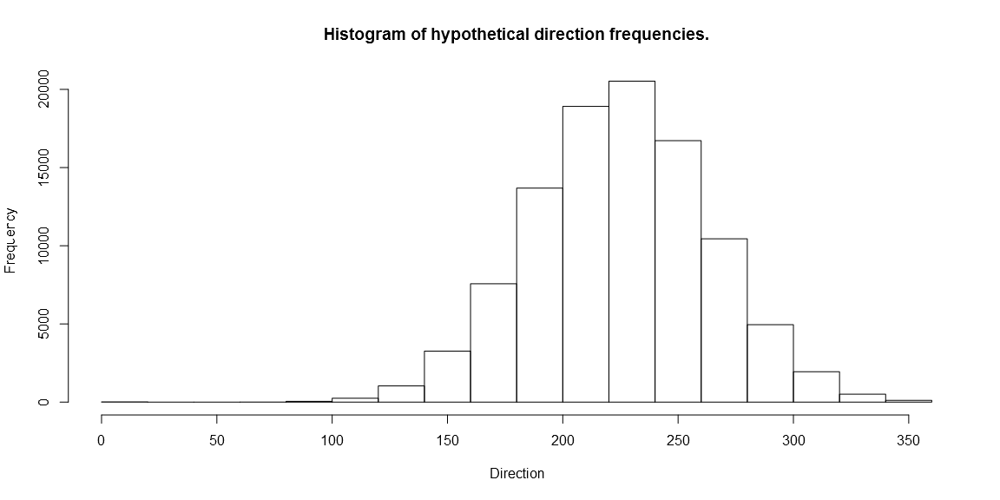
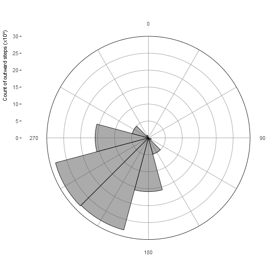

## Introduction

This is another post regarding some plots that I needed to make for a publication. As before, I relied heavily on Stack Exchange and many other sites for figuring out how to get my plot looking the way I needed it to, and so this is my attempt to contribute back to the broader community.

In my article I wanted a graphic which illustrated the preferred outward post-moult migration direction of adult female southern elephant seals from Marion Island. In reality it doesn't matter too much what you want to plot, and these sorts of plots are more generally used for wind direction illustrations. Really, they are like radial histograms. In fact, if you look through the ggplot2 call, it is basically a histogram until the last couple of lines, where it is wrapped into a wind rose.

## The data

As I mentioned, my data was related to seal swimming directions, gathered from satellite tags. For this tutorial I will simulate 100000 directions using the wrapped normal function (rwrpnorm) from the CircStats package.


```r
library(ggplot2)
library(CircStats)

set.seed(1)
data <- data.frame(direction = deg(rwrpnorm(100000, rad(225), rho=0.8, sd=1)))

# Take a quick look...
hist(data$direction, main = "Histogram of hypothetical direction frequencies.", xlab = "Direction", ylab = "Frequency")
```

<!-- -->

That looks like a reasonable distribution of directions, favouring 225°.

## Method

There are various ways to split and plot these data. Some searching lead me [to this one](http://stackoverflow.com/questions/17266780/wind-rose-with-ggplot-r). First we will define the bin width (30°), then we will define dir.breaks which stores the range of each bin as follows 345°-15°, 15°-45°, 45°-75° etc.


```r
# choose bin size (degrees/bin)
deg <- 30 
# define the range of each bin
dir.breaks <- seq(0-(deg/2), 360+(deg/2), deg)
```

Now we generate a factor variable, exchanging the directions with the ranges. We'll also generate some pretty labels and assign them as levels of the new object. Finally we'll attach the new variable to the main dataset.


```r
# assign each direction to a bin range
dir.binned <- cut(data$direction,
                       breaks = dir.breaks,
                       ordered_result = TRUE)
# generate pretty lables
dir.labels <- as.character(c(seq(0, 360-deg, by = deg), 0))
# replace ranges with pretty bin lables
levels(dir.binned) <- dir.labels
# Assign bin names to the original data set
data$dir.binned <- dir.binned
```
## Plotting

### Theming

The important points here are blank values for `panel.border` and `panel.grid`. This turns off the default background for ggplot2 so that we can define the borders and grids manually later.


```r
thm <- theme_bw() + 
    theme(axis.text.x = element_text(size=8, face = "plain"),
          axis.text.y = element_text(size=8, face = "plain"),
          axis.title.x = element_blank(),
          axis.title.y = element_text(size=8, face = "plain", hjust = 0.9, vjust = 1.3),
          panel.border = element_blank(),
          panel.grid  = element_blank())
```

### Now the main plot...

The main plot sets things up quite specifically. What we need to know before going on is the frequency of the most common bin.


```r
summary(dir.binned)
```

```
##     0    30    60    90   120   150   180   210   240   270   300   330 
##    79     1     5    83   884  4993 15875 28134 28403 15751  4926   866
```

So there are 28403 counts of the 240° bin. We need this value to set our y-scales correctly. Our y-axis will have breaks every 5000 counts so we'll use 30000 as the max for the y-axis. The first parts of this plot will plot a rectangular histogram, only the `coord_polar` function wraps it into a wind rose.


```r
# initialise the plot
plt.dirrose <- ggplot() +
    # since the plot background is blank we'll add a series of horizontal lines, at 5000 count intervals, up to 25000.
    geom_hline(yintercept = seq(0, 25000, by = 5000), colour = "grey60", size = 0.3) +
    # Now we add a darker horizontal line as the top border at 30000.
    geom_hline(yintercept = 30000, colour = "black", size = 0.3) +
    # We want 12 vertical lines representing the centers of the 30° ranges.
    geom_vline(xintercept = c(seq(1,12,1)), colour = "grey60", size = 0.3) +
    # On top of everything we place the histogram bars.
    geom_bar(data = data, aes(x = dir.binned), width = 1, colour="black", size = 0.3, alpha=0.5) + 
    # Add the x-axis labels
    scale_x_discrete( drop = FALSE, labels = c(0, "", "", 90, "", "", 180, "", "", 270, "", "")) +
    # Add the y-axis labels
    scale_y_continuous(limits = c(0, 30000), expand = c(0, 0), 
                       breaks = c(0, 5000, 10000, 15000, 20000, 25000, 30000), 
                       labels = c(0, 5, 10, 15, 20, 25, 30)) +
    # Add the axis titles
    labs(x = 'Outward step bearing (°)', y = 'Count of outward steps (x10³)') +
    # If you only use the plot code up till here you will get a histogram.
    # the next line wraps the histogram into a windrose
    coord_polar(start = -(deg/2)*(pi/180)) +
    # apply theme
    thm

plt.dirrose
```

<!-- -->

There we have it; a wind rose, in grey scale illustrating our data exactly as we need it to.

***Saving the plot according to the publishers requirements***

For completeness, this is one approach to saving your plots


```r
ggsave(filename = 'plt.dirrose.png', plot = plt.dirrose, width = 84, height = 84, units="mm", dpi = 300, type="cairo-png")
```

Hope this helps :)
